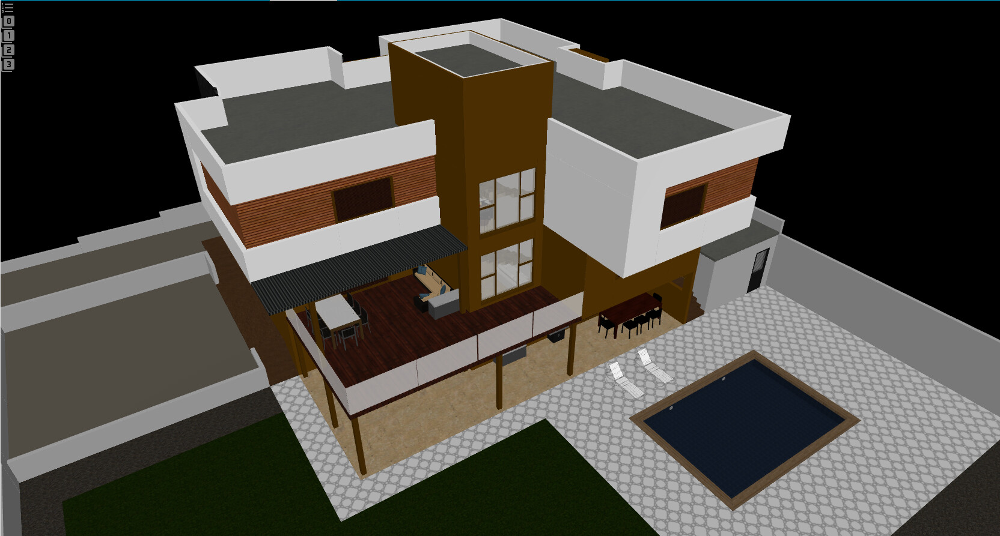

# Floor3D [PRO] Card  
## Your Home Digital Twin – Game Engine Backbone Edition
---
>## 🔗 Floor3D [PRO] Card (source & documentation):  
>- **<https://github.com/levonisyas/floor3dpro-card>**
>- **<https://community.home-assistant.io/t/your-home-digital-twin-interactive-floor-3d-plan-pro/>**

---


---

>#### **Original concept and vision:** `floor3d-card` by **@andyHA** – with full respect and acknowledgment of the foundational work.  

🔗 **Original card (source & documentation):**  
<https://github.com/adizanni/floor3d-card>

> **⚠️ Important:**  
> This is **not a feature expansion** of the original project.  
> For feature requests or development inquiries, please contact the original author.

---

## Overview

**Floor3D [PRO] Card** is a Lovelace card for Home Assistant that enables the creation of a **3D digital twin** of a home based on its physical structure, providing an **interactive 3D floor plan**. The card represents device and sensor data from Home Assistant through a three-dimensional home model in a **visual and interactive** manner.

- The card associates Home Assistant entities such as lights, switches, doors, windows, shutters, and sensors with objects within the 3D model, allowing the current state of the home to be observed within a single scene.
- For example, when a room light is turned on, the corresponding area is illuminated in the model; door, window, and shutter objects visually reflect their open–close states, while sensors display their associated states directly within the scene.

> **Floor3D [PRO] Card**, unlike approaches based on 2D images or image-based floor plans, builds the scene using real **3D geometry**.  
> This allows the entire home to be monitored and interactively managed through a single **3D scene**, particularly in large or multi-story environments.

Technically, the card uses a home model created with 3D modeling tools such as **Sweet Home 3D, Rhino, 3ds Max, Blender, SketchUp**, and similar software, exported in obj or glb format.  
The model is uploaded to Home Assistant and defined through the card configuration.  
The 3D scene is generated using a JavaScript-based 3D rendering infrastructure and is synchronized with Home Assistant entity states in real time.

---

## Context

The original `floor3d-card` works exceptionally well and introduced a powerful idea: a true **digital twin** inside Home Assistant.  
However, as models grow large and entity counts increase, natural performance and lifecycle limits emerge — not due to poor design, but because UI‑driven architectures do not scale like engines.  
**This project focuses on scaling and stabilization, not on rewriting the core idea.**

## Built on a Real Game-Engine Backbone  
`Release` *1.5.3-Pro.Faz.0*

**Shaped by architectural discipline — not just code.**  
**Not a game engine, but engineered to behave like one.**  
This card implements a **deterministic game-engine architecture** for both **rendering** and **asset management**.

---

## Determinism as the Primary Goal

This isn’t a performance hack — **it's determinism as a foundation.**  
**Deterministic rendering. Deterministic assets. Isolated instances. Stable behavior.**

---

## Floor3D Pro enforces Home Assistant UI components to operate through a deterministic render scheduler gate, which acts as a game-engine backbone.

It replaces random render triggers with a **deterministic render scheduler** using a single entry point: `_requestRender()`.

All inputs—Hass updates, resize events, camera movements—pass through a **controlled render flow through a single gate**, ensuring **100 triggers → 1 render**.

The engine enforces **state management and load separation**, clearly separating the "awake" state from model loading to prevent premature rendering.

A strict **State → Index → Apply → Render** chain and enforced index-space integrity ensure smooth, predictable behavior, even with hundreds of entities.

This deterministic backbone improves **performance and stability**, eliminating lag, jitter, and freezes on low-power devices while delivering a responsive digital twin experience.

---

## Floor3D Pro enforces Home Assistant UI asset usage through a deterministic asset cache, which acts as a game-engine backbone.

Floor3D Pro now handles asset loading like a **real game engine**: each asset **loads once**, and every instance receives a **deep clone**.

**UI-driven re-instantiation** from preview panels, YAML edits, or parallel cards is **kept under control**, preventing **duplicate fetches**, **parse storms**, and **race conditions**.

A **deterministic cache and promise coalescing** strategy uses a **strict cache key** (`path + objfile (+ mtlfile)`) to ensure **predictable behavior**, while **simultaneous requests** resolve into a **single load**.

Cached assets remain **read-only**, while each instance receives **isolated materials, geometry, textures, and transforms** on a **shared backbone**.

The engine loop remains **unchanged** (`State → Index → Apply → Render`), but the backbone becomes **stable**, **deterministic**, and **immune to UI-driven chaos**.

---

## Floor3D Pro enforces Home Assistant card editing through a deterministic transactional editor, which acts as a game‑engine backbone.

It replaces uncontrolled edit‑time rebuilds with a **deterministic transactional editor pipeline** governed by a single commit gate.

All editor inputs—typing, selection changes, entity operations, and structural edits—pass through a **controlled draft‑and‑commit flow**, ensuring **100 micro‑changes → 1 commit**.

The editor enforces **state separation and transactional integrity**, clearly distinguishing draft mutations from committed updates to prevent premature rebuilds.

A strict **Draft → Commit → Apply** chain and enforced transactional boundaries ensure smooth, predictable editing behavior, even in complex multi‑entity configurations.

This transactional editor backbone improves **responsiveness and reliability**, eliminating jitter, random rebuilds, and F5‑style refresh storms while delivering a stable, game‑engine‑like editing experience even on low‑power devices.

---

>## Deterministic Correction: (Fix)  
>*Repairs the original behavior through a clean, deterministic game‑engine backbone..*

* **Overlay is display‑only** — must not block clicks on level/zoom controls  
* **Touchstart listener marked passive** — prevents scroll‑blocking violations  
* **Canvas obscurity logic corrected** — animation stops only when a real dialog/overlay is present, not when root containers appear  
* **Edit-Card preview guard added** — unsafe DOM traversal no longer crashes the card  
* **Raycasting concat pressure eliminated** — deterministic rebuild without array growth  
* **Cover/Index alignment restored** — _states and _position now map deterministically, including valid 0 positions  
* **Editor lifecycle guard added** — early render() calls no longer risk undefined-access crashes  
* **Edit‑Card fallback template enabled** — hostile lifecycle states no longer break the editor  
* **DOM custom‑element isolation added** — original and Pro cards can run side‑by‑side without conflict.

---

## Additional PRO Features  
`Release` *1.5.3-Pro.Faz.1*

---

### Engine Behavior Tracing

Optional detailed logging for debugging engine behavior.  
Allows tracing render scheduling, asset cache and lifecycle decisions without polluting normal logs.

**Activation** *(This feature is **opt-in** and disabled by default.)*

```yaml
pro_log: engine
```

---

### Level-Based Entity Filtering (Pro Skill: `level`)  
`Release` *1.5.3-Pro.Faz.1.A*

---

This update introduces a **performance‑oriented execution filter** designed for large, multi‑level 3D models with many entities.  
Each entity can define a numeric `level`:

- **`-1`** → Exterior or always‑active entities  
- **`0, 1, 2, ...`** → Interior floors

Entities at **level `-1`** remain active at all times (security, climate, exterior lights, alarms, etc.) and are never paused.

The visual level buttons continue to work as before; this feature does **not** change what is shown on screen.  
Instead, it adds a new execution rule that improves performance:

**Active entities = level `-1` + the highest currently visible level**

Entities with **`level: -1`** defined in the YAML configuration are **always active**.  
All other entities become active only when their YAML‑defined level **exactly matches** the highest visible level; entities on non‑matching levels become inactive.

All other entities become **inactive**, meaning:

- They stop receiving Home Assistant state updates  
- They are skipped in render/update cycles  
- Click and interaction events are ignored  
- No services are triggered for them  

The highest visible level is determined from the internal `_displaylevels[]` state.

**Activation** *(This feature is **opt-in** and disabled by default.)*

```yaml
pro_skill: level
```

**Usage**

```yaml
- entity: <your_entity>
  object_id: <your_object_id>
  level: 3
  # and so on
```

---

### Deterministic Manual‑Commit Editing (Pro Skill: `editor`)  
`Release: 1.5.3‑Pro.Faz.1.B`

---

This skill introduces a deterministic **manual‑commit editing model** for complex 3D setups where automatic commits cause instability or preview resets.  
It changes **how** edits are committed — not **what** can be edited.

When enabled:

- Automatic `config-changed` commits are disabled  
- All editing actions remain fully interactive  
- Editor updates stay local  
- No debounce, no background commits, no preview‑triggered commits, no commit‑spam

Editing becomes **free**, but applying changes becomes **intentional**.

A dedicated **SAVE/Commit Changes** button appears.  
This is the **only** allowed path for configuration updates.

<span style="color:red">To apply your changes, press the **Commit Changes** button.</span>

- One click → one deterministic commit  
- No alternative commit routes  
- No auto‑commit, no lifecycle commits, no preview commits  

This enforces a clean **draft → commit → apply** pipeline.

Why this exists:

- Prevents preview rebuild storms  
- Prevents model reload loops  
- Prevents editor flicker or resets  
- Prevents incomplete configs being sent to HA  
- Keeps editing responsive on weak devices  

With this skill, configuration is committed **once**, intentionally.

**Activation** *(This feature is **opt-in** and disabled by default.)*

```yaml
pro_skill: editor
```

Design principle:

**Editor input is free. Commit is intentional.**

What it disables:

- Navigation‑triggered commits  
- Focus/scroll commits  
- Preview lifecycle commits  
- “New card” creation commits  
- Any implicit `config-changed` spam  

All changes remain local until manually committed.

In plain terms:

**Prevents the editor from “saving on every move”.**

If previews break, cards re‑create themselves, or edits apply before you finish — this skill fixes exactly that.

---

### Mobile‑only Mode (PRO) — Coming Soon

A dedicated mode optimized specifically for tablets and phones:

- adjusted pixel ratio  
- reduced shadow cost  
- mobile‑friendly render parameters  

The result is smoother interaction and a better balance between performance and battery usage on mobile devices.

---
>**From this point onward, the content is sourced from the original** `floor3d-card` by **@andyHA** and has been adapted, condensed, and reformatted for this documentation.

---

## 3D Model Preparation

### Recommended Workflow (Easy Method)

- **Sweet Home 3D is recommended** because it provides the simplest workflow for designing your home model with furniture and objects.  
- After modeling, export using the **ExportToHASS** plugin **(original author @andyHA)**:  
  <https://github.com/adizanni/ExportToHASS> 
- This plugin generates an **OBJ** model with correct object groups for the Floor3D card.

### Use GLB Instead of OBJ

- OBJ exports create many files and are often large in size.  
- **GLB is faster, lighter, and more efficient** for the card.

**To convert OBJ → GLB, install Node.js and run:**

```
npm install -g obj2gltf
obj2gltf -i home.obj -o home.glb --checkTransparency
```

**To optimize your GLB using Draco compression, install Node.js and run:**

```
npm install -g gltf-pipeline
gltf-pipeline -i home.glb -o home_compressed.glb --dracoCompression
```

Copy the resulting `.glb` file into your Home Assistant `/config/www/community/floor3dpro-card/` folder.

---

### Advanced Workflow (Professional Tools: Rhino, 3ds Max, Blender, SketchUp)

- The card can support models created in **Sweet Home 3D, Rhino, 3ds Max, Blender, SketchUp**, and similar tools, exported as **OBJ or GLB**.

**Importing OBJ for Editing**

When importing the OBJ generated by ExportToHASS into a professional 3D tool:

- Import OBJ groups as: **layers**  
- Import OBJ objects as: **none / nothing**

This preserves the grouping logic required by the Floor3D card.

**Exporting Back to OBJ**

When exporting your edited model back to OBJ:

- Do NOT export **object names**  
- Export **layers as OBJ groups**

This ensures compatibility with the card’s object‑group structure.

**Critical Rule: Layer = Object Group**

- Every layer must have a **unique name**.  
- Professional 3D tools treat **layers** the same way Sweet Home 3D treats **object groups**.

**Example Mapping**

- **SweetHome3D OBJ:**  
  Group (door) → wing + frame + handle  
  `g lvl001Door_1`
- **Professional App:**  
  Layer (door) → wing + frame + handle  
  `Layer lvl001Door_1`

**Level Naming Convention (original author’s format)**

Use layer names like:

- `lvl000Flowers_18_3`  
- `lvl001...`  
- `lvl002...`

These represent floors/levels, and if you don’t follow this naming convention, the level buttons will not work.  
When exporting, layer names become OBJ groups.

**Key Principle:** OBJ group = **layer**  
This is the shared logic across all professional 3D modeling applications.

---

## Installation

### Method 1: HACS (Recommended)

1. Open **HACS** in Home Assistant.  
2. Click the three dots (`⋮`) in the top‑right corner.  
3. Select **"Custom repositories"**.  
4. Add this repository URL:  
   <https://github.com/levonisyas/floor3dpro-card>
5. Set category: **"Dashboard"**.  
6. Click **"Add"**.  
7. Find **"HA Digital Twin Pro Upgrade"** in HACS and install.  
8. **Restart Home Assistant.**

### Method 2: Manual Installation

1. Download `floor3dpro-card.js` from the repository:  
   <https://github.com/levonisyas/floor3dpro-card>
2. Place the file in:  
   `/config/www/community/floor3dpro-card/`  
3. Add as a Lovelace resource:

```yaml
resources:
  - url: /local/community/floor3dpro-card/floor3dpro-card.js
    type: module
```

---

## Build Chain (`Floor3D [PRO] Card`)

### Supported / Verified Environment

- **OS:** Windows  
- **Node.js:** **v16.20.2**  
- **npm:** **8.19.4**

> ⚠️ **Note:** Node.js 18/20 may work but are **not officially supported** for this repository at this time.

### Locked Tool Versions (Stable Build)

These versions are confirmed to build successfully:

- **TypeScript:** **4.3.5**  
- **Rollup:** **2.62.0** (2.62.x)  
- **rollup‑plugin‑typescript2 (rpt2):** **0.30.0**  
- **tslib:** **2.6.2** *(TS helper — resolves `tslib cannot be found` errors)*

---

## Configuration

>**north**

**`north` defines the north direction on the X‑Z plane.**  
For example, **`{x: 0, z: 1}`** (the default) represents north pointing in the positive Z direction.  
Used together with **`sky: yes`** for correct orientation.

```
north:
  x: 0
  z: -1
```

---

>**Camera Rotation, Camera Position and Camera Direction**

In edit mode, double‑clicking on an empty area of the model retrieves the current camera position and rotation. A prompt box appears showing two sets of coordinates, which you can copy and paste into the card configuration in code editor mode. This allows you to manually define the new default camera position.

```
camera_position:
  x: 609.3072605703628
  "y": 905.5330092468828
  z: 376.66437610591277
camera_rotate:
  x: -1.0930244719682243
  "y": 0.5200808414019678
  z: 0.7648717152512469
camera_target:
  x: 37.36890424945437
  "y": 18.64464320782064
  z: -82.55051697031719
```

---
>### 3D Model  

|3D Model | Description|
|--- | ---|
|Name | Defines the name assigned to the 3D model.|
|Path | Specifies the directory path where the 3D model files are located.|
|Obj / Glb file | Defines the 3D model file to be used (.glb or .obj).|
|Mtl Wavefront file | Specifies the .mtl material file required for .obj models.|
|Object list JSON | Defines the JSON file mapping model objects to HA entities.|

---

>### Appearance  

| Appearance        | Description                                                             |
|-------------------|-------------------------------------------------------------------------|
| Style             | Defines the general style applied to the card’s canvas element.         |
| Lock Camera       | Locks camera zoom/rotation when set to yes.                             |
| Selection Mode    | Enables object selection mode for console listing.                      |
| Edit Mode PopUp   | Enables popup notifications in edit mode.                               |
| Header            | Defines whether the card header is displayed.                           |
| Click             | Enables single‑click interaction.                                       |
| Overlay           | Enables the overlay panel for object‑related data.                      |
| Background Color  | Defines the canvas background color.                                    |
| Hide Levels Menu  | Hides the level selection menu.                                         |
| Global Scene Light| Defines global light intensity (0..1).                                   |
| Shadow            | Enables shadow casting for lights.                                      |
| + Lights - Perf   | Enables extra‑light performance mode.                                   |
| Show Axes         | Displays 3D axes in the scene.                                          |
| Sky               | Enables sky, ground, and sun environment.                               |

---

**Overlay and Action**

When you enable overlay in the card’s Appearance settings, additional customization options appear, such as alignment, size, fonts, and colors. This creates a panel displayed on top of the model canvas. You must also enable the click option for it to function. Each entity has an action parameter that defines what happens when its associated object is clicked. If action is set to “overlay,” clicking the object displays the entity’s name and state inside the overlay panel.

---

>### Entities

|Entity | Description|
|--- | ---|
|Entity | Defines the Home Assistant entity to attach to the card, using either a direct entity_id or an object_group reference (not applicable for text and gesture).|
|Type & Object | Defines the binding between the entity and the 3D object, specifying the object_id of the model element to link with the entity.|
|Template | Defines a dynamic JavaScript template in the format `[[[ template ]]]` that reacts to the entity’s state using variables such as $entity.|
|Action | Defines the on‑click behavior for the entity, supporting 'more-info', 'overlay', or 'default' actions.|
|3D Type | Defines how the entity is represented in the 3D scene, using types such as light, hide, color, text, gesture, door, or rotate.|
|Object | Specifies the object_id of the 3D model element that the entity will be bound to.|

---

>### 3D Type — Light
Light behavior is straightforward: the light object illuminates when the linked Home Assistant entity is turned on, and turns off when the entity is off. If the light entity has color or brightness attributes, they are used to render the light. Double‑clicking the light object toggles it.

|Light options | Description|
|--- | ---|
|Lumens | Defines the light’s brightness level (0–5000), with typical LED and bulb sources reaching up to 4000 lumens.|
|Color | Defines the emitted light color; ignored if the light entity provides its own color/temperature attributes.|
|Decay | Controls how quickly the light intensity decreases over distance (0–2 typical).|
|Distance | Sets the maximum effective range of the light in centimeters.|
|Shadow | Determines whether the light casts shadows.|
|Target Object | Specifies the target object for spot lights.|
|Angle | Defines the beam angle of the spot light in degrees.|
|Vertical Alignment | Controls vertical alignment: top, middle, bottom.|
|Direction | Defines the direction vector of a spotlight using x, y, z coordinates.|

---

>### 3D Type — Color
The object is painted with the defined color when the state of the linked entity matches the specified value.

|Color condition | Description|
|--- | ---|
|Color | Defines the color to apply (Hex, HTML, RGB).|
|State | Defines the entity state in which the color is applied.|

---

>### 3D Type — Room
A parallelepiped is drawn to highlight the room. Works with all room objects whose names contain “room.” Non‑rectangular rooms are simplified. Supports color condition.

| Room options         | Description                                      |
|----------------------|--------------------------------------------------|
| Transparency %       | Defines the room’s transparency level.           |
| Color                | Defines the base color of the room.              |
| Elevation (cm)       | Sets the vertical position of the room.          |
| Label                | Controls label visibility.                       |
| Label text           | Defines the text displayed on the label.         |
| Label Width          | Label width in scaled cm.                        |
| Label Height         | Label height in scaled cm.                       |
| Attribute            | Optional entity attribute to display.            |
| Font                 | Font used for the label text.                    |
| Span percentage      | Percentage of the plane the label spans.         |
| Text Background Color| Background color of the label text.              |
| Text Foreground Color| Foreground (text) color.                         |
| Color (Condition)    | Color applied when condition is met.             |
| State (Condition)    | Entity state that triggers the conditional color.|

---

>### 3D Type — Hide
The object is hidden when the entity matches the specified state.

| Hide options | Description                                |
|--------------|--------------------------------------------|
| State        | Defines the entity state that hides object.|

---

>### 3D Type — Show
The object becomes visible when the entity matches the specified state.

| Show options | Description                                 |
|--------------|---------------------------------------------|
| State        | Defines the entity state that shows object. |

---

>### 3D Type — Text
The object displays the entity’s state text.

| Text options        | Description                                |
|---------------------|--------------------------------------------|
| Transparency %      | Defines transparency level.                |
| Color               | Defines base color.                        |
| Elevation (cm)      | Vertical position.                         |
| Label               | Label visibility.                          |
| Label text          | Text displayed.                            |
| Label Width         | Width in scaled cm.                        |
| Label Height        | Height in scaled cm.                       |
| Attribute           | Attribute used for text.                   |
| Font                | Font used.                                 |
| Span percentage     | Percentage of plane used.                  |
| Text Background Color| Background color.                         |
| Text Foreground Color| Text color.                              |
| Color (Condition)   | Conditional color.                         |
| State (Condition)   | State that triggers conditional color.     |

---

>### 3D Type — Door
A door or window rotates or slides depending on type.

| Door options    | Description                                   |
|-----------------|-----------------------------------------------|
| Door Type       | Movement type: swing or slide.                |
| Side            | Hinge or sliding side.                        |
| Direction       | Opening direction: inner or outer.            |
| Degrees         | Max opening angle (swing).                    |
| Percentage open | Opening percentage (slide).                   |
| Pane object     | Moving pane object_id.                        |
| Hinge object    | Hinge object_id.                              |

---

>### 3D Type — Cover

| Cover options | Description                         |
|---------------|-------------------------------------|
| Pane object   | Moving cover component.             |
| Side          | Opening direction: up or down.      |

---

>### 3D Type — Rotate
The object rotates when the entity is “on.”

| Rotate options     | Description                                |
|--------------------|--------------------------------------------|
| Axis               | Rotation axis: x, y, z.                    |
| Hinge-pivot object | Pivot object for grouped rotation.         |
| Rounds per second  | Rotation speed (negative reverses).        |

---

>### 3D Type — Gesture
Double‑click triggers a domain.service call.

| Gesture options | Description                         |
|-----------------|-------------------------------------|
| Domain          | Home Assistant service domain.      |
| Service         | Specific service to execute.        |

---

>### 3D Type — Camera

Double‑clicking opens a pop‑up showing the camera view.

---

>### Object Groups

| Object Groups | Description                         |
|---------------|-------------------------------------|
| Object Group  | Name of the group.                  |
| Objects       | List of 3D objects in the group.    |
| Object Id     | object_id of each object.           |

---

>### Zoom Areas

| Zoom Areas   | Description                         |
|--------------|-------------------------------------|
| Zoom         | Name of the zoom area.              |
| Object       | Target 3D object.                   |
| Distance (cm)| Camera distance during zoom.        |

---